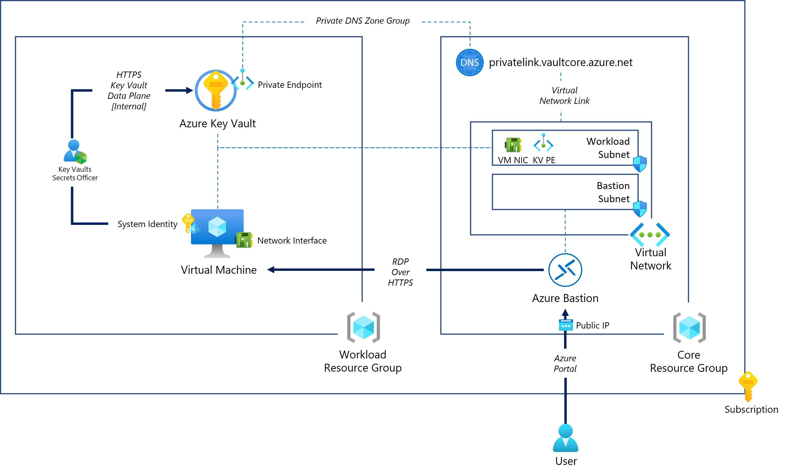

# Demo deploying using CARML modules using Template Specs

This repository contains a demo deploying a solution using the [CARML](https://aka.ms/carml) Bicep library.

## Architecture



## Description

This architecture deploys the following:

### Core Resource Group

Containing:

- Azure Virtual Network, with two subnets, one for workloads and one for Azure Bastion. The subnets are protected with Network Security Groups.
- Private DNS Zone for Azure Key Vault, and integrated into the Virtual Network
- A Public IP and Azure Bastion Host deployed into the Virtual Network subnet for Azure Bastion.

### Workload Resource Group

Containing:

- Azure Key Vault, with public network access disabled, and uses the Azure RBAC authorization model. It also has a Private Endpoint deployed into the Virtual Network workload subnet, and also linked to the Private DNS Zone for Azure Key Vault.
- An Azure Virtual Machine deployed into Virtual Network workload subnet, with a System Assigned Managed Identity that has the 'Secrets Officer' Role at the Azure Key Vault Scope.

## Deployment

**Average Deployment time**: 10 minutes

- Open a Visual Studio Code session, clone the repository and then open up a VS Code session in the folder for the cloned repo.

- Update the [bicepconfig.json](/solution/bicepconfig.json) by modifying the Template Spec Alias information. Set the `subscription` to the SubscriptionId where your modules are stored. Also update `resourceGroup` to the Resource Group where your Template Spec modules are stored.

- Deploy the [main.bicep](/solution/main.bicep) by modifying the `identifier` parameter to something that is unique to your deployment (i.e. a 5 letter string). Then specify the Virtual Machine password field which is a secure string.

```powershell
New-AzDeployment -Location 'australiaeast' -deploymentname 'carmldemo' -TemplateFile '<<path to the repo>>\main.bicep'
```

---
**Note**: The deployment assumes you have published your [CARML](https://aka.ms/carml) into Azure Template Specs. And your identity has read permissions on the Resource Group containing the Template Specs.

---
- The deployment will first deploy the [core.bicep](/solution/childModules/core.bicep) file, which results in a Resource Group with the core resources inside it.
- The deployment will then deploy the the [workload.bicep](/solution/childModules/workload.bicep), which results in another Resource Group with the workload resources inside it.

## Testing

Once the deployment is complete, navigate to the Virtual Machine blade, and connect via Azure Bastion. 
- Provide your user name and password, which will then open up a new browser tab for the RDP over HTTPS session using Azure Bastion.

---
Note: The username for the Virtual Machine is `carmldemo` and the password is the one you used when deploying the template

---

- Open up PowerShell on the Virtual Machine, and authenticate to Azure using the System Managed Identity for the Virtual Machine, then retrieve the Key Vault information

```powershell
Add-AzureRmAccount -Identity
$KeyVault = Get-AzureRmKeyVault
nslookup "$($KeyVault.VaultName).vault.azure.net"
```

- The returned value should be the Private IP address of the Key Vault. Meaning that the data plane traffic to this Key Vault is using the Virtual Network.

---
**Note**: The reason Azure cmdlets work on this Virtual Machine is because Image of this VM contains a Visual Studio installation. However the cmdlets are using the legacy Azure RM modules and not the Az ones. But that is ok for our testing as it will have the necessary cmdlets needed to validate this demo.

---

- Next create a secret in the PowerShell session:

```powershell
$MyTestSecret = Read-Host -AsSecureString
```

- Next upload this secret to the Azure Key Vault:

```powershell
Set-AzureKeyVaultSecret -VaultName $KeyVault.VaultName -SecretName 'TestSecret' -SecretValue $MyTestSecret | Select-object Id, Name
```

- To retrieve the secret from the Key Vault

```powershell
Get-AzureKeyVaultSecret -VaultName $KeyVault.VaultName -SecretName 'TestSecret' | Select-Object SecretValueText
```

These data plane operations are only accessible from the Virtual Network

- To delete the demo resources, from your IDE where you deployed the template:

```powershell
Remove-AzResourceGroup -Name "rg-<<youridentifer>>-core" -Force
Remove-AzResourceGroup -Name "rg-<<youridentifer>>-workload" -Force
```

